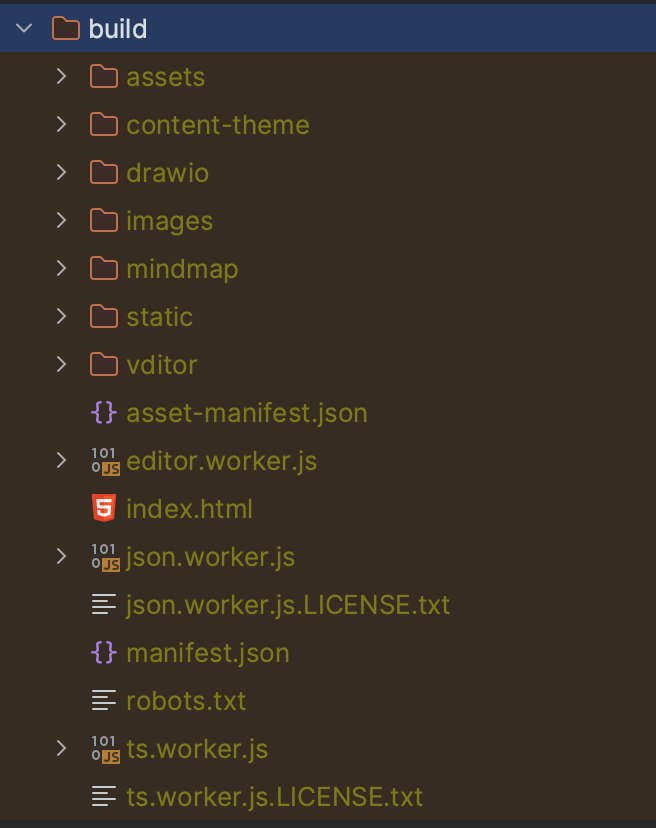

## 编译环境准备
1. 下载node v18.17.1+ [node官网地址](https://nodejs.org/en)
2. 在项目根目录执行
```
npm install --force
```

## 前端调试(src目录下的代码)
1. 启动EffectNote桌面客户端，确保 http://localhost:51223/ 可正常打开
2. 在项目根目录执行
```
npm run startdev
```
3. 浏览器自动跳转 http://localhost:3000/ 即可进行调试

## 后端调试(main目录下的代码)
1. 彻底关闭EffectNote桌面客户端
2. 提前生成前端静态文件
```
npm run build
```
执行成功后，build目录下将有以下内容

3. 启动electron调试进程
```
npm run start
```
## 生成windows安装包
1. 依次执行以下命令
```
npm run build-win32
del -A ./node_modules/.cache
electron-forge make --platform win32
```

## 生成Mac无签名包
1. 注释forge.config.js的line39~line49
2. 执行编译命令
```
npm run make
```

