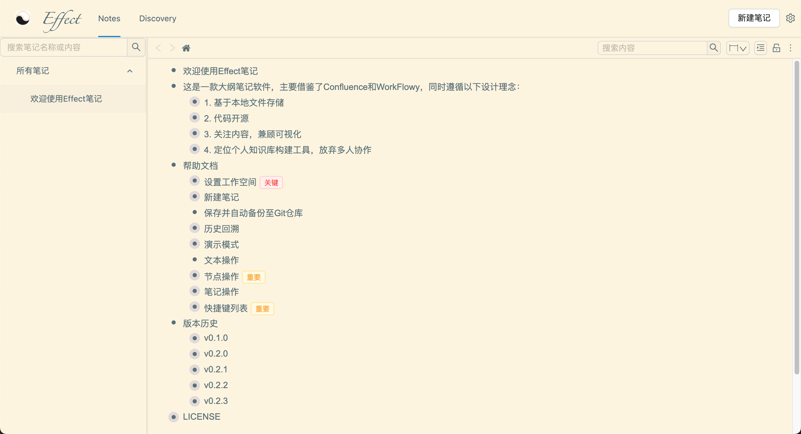
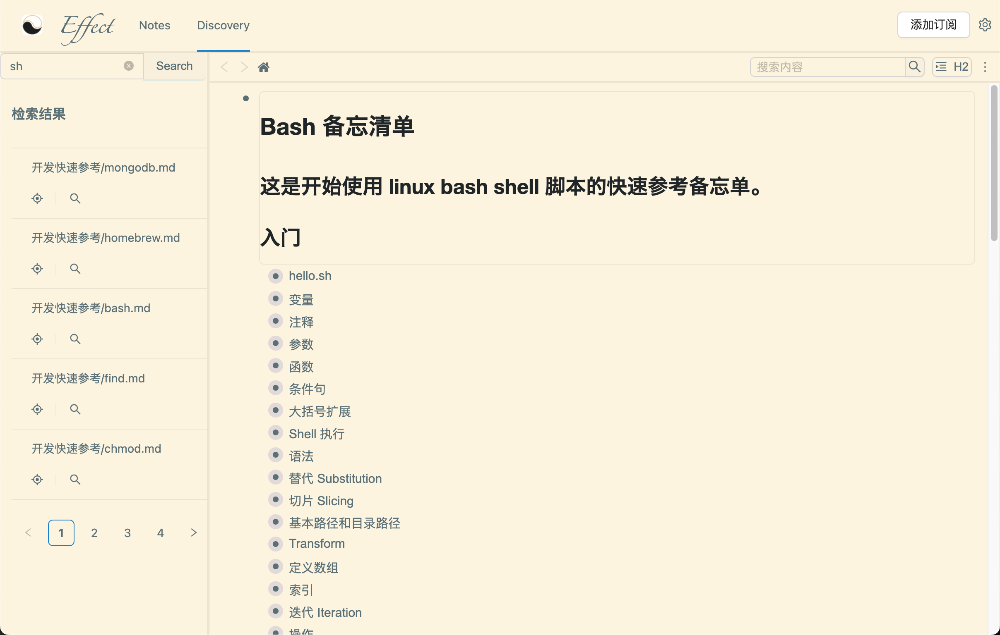

 
一款免费的大纲笔记软件，纯文件存储，Gitee云端同步
 
  
    <a target="_blank" href="https://effect-note-demo-1314328063.cos-website.ap-beijing.myqcloud.com/note/-1">在线Demo</a> |
    <a target="_blank" href="https://pan.baidu.com/s/1y0Ouxh_kOxNHQcpjUeArVg?pwd=evzn">Mac客户端下载</a> |
    <a target="_blank" href="https://pan.baidu.com/s/1gQTLyW7GHW4iSzroVmy4fQ?pwd=2qmc">Windows客户端下载</a>
  
 
Inspired By Confluence & Workflowy
 
Project Vision：Empower Personal Knowledge Management And Discovery

## 功能演示

### 笔记页面

### 订阅检索

## Thanks To
- [react](https://github.com/facebook/react)
- [vimflowy](https://github.com/WuTheFWasThat/vimflowy)
- [ant-design](https://github.com/ant-design/ant-design)
- [isomorphic-git](https://github.com/isomorphic-git/isomorphic-git)
- [electron](https://github.com/electron/electron)
- [wangEditor](https://github.com/wangeditor-team/wangEditor)
- [vditor](https://github.com/Vanessa219/vditor)
- [tesseract.js](https://github.com/naptha/tesseract.js)
- [drawio](https://github.com/jgraph/drawio)
- [lunr.js](https://github.com/olivernn/lunr.js)
